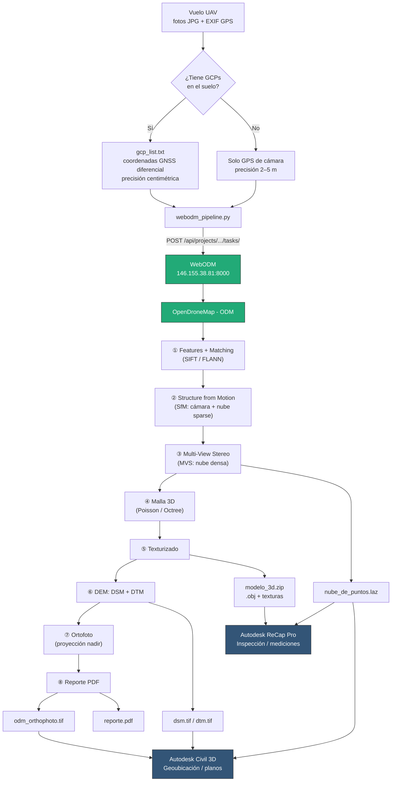

# Diagrama de flujo — IPRE IPI-26-704

## Flujo de procesamiento fotogramétrico (dentro de ODM)

```mermaid
flowchart TD
    A[Vuelo UAV\nfotos JPG + EXIF GPS] --> B{¿Tiene GCPs\nen el suelo?}
    B -->|Sí| C[gcp_list.txt\ncoordenadas GNSS diferencial\nprecisión centimétrica]
    B -->|No| D[Solo GPS de cámara\nprecisión 2–5 m]

    C --> E[webodm_pipeline.py]
    D --> E

    E -->|POST /api/projects/.../tasks/| F[WebODM\n146.155.38.81:8000]
    F --> G[OpenDroneMap - ODM]

    G --> G1["① Features + Matching\n(SIFT / FLANN)"]
    G1 --> G2["② Structure from Motion\n(SfM: cámara + nube sparse)"]
    G2 --> G3["③ Multi-View Stereo\n(MVS: nube densa)"]
    G3 --> G4["④ Malla 3D\n(Poisson / Octree)"]
    G4 --> G5["⑤ Texturizado"]
    G5 --> G6["⑥ DEM: DSM + DTM"]
    G6 --> G7["⑦ Ortofoto\n(proyección nadir)"]
    G7 --> G8["⑧ Reporte PDF"]

    G8 --> H1[odm_orthophoto.tif]
    G3 --> H2[nube_de_puntos.laz]
    G5 --> H3[modelo_3d.zip\n.obj + texturas]
    G8 --> H4[reporte.pdf]
    G6 --> H5[dsm.tif / dtm.tif]

    H1 --> I1[Autodesk Civil 3D\nGeoubicación / planos]
    H2 --> I2[Autodesk ReCap Pro\nInspección / mediciones]
    H3 --> I2
    H2 --> I1
    H5 --> I1

    style F fill:#2a7,stroke:#333,color:#fff
    style G fill:#2a7,stroke:#333,color:#fff
    style I1 fill:#357,stroke:#333,color:#fff
    style I2 fill:#357,stroke:#333,color:#fff
```